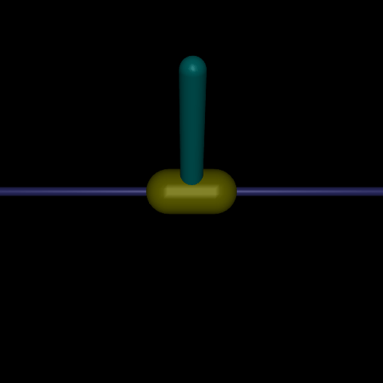

# Model-Based Deep Reinforcement Learning with Model Predictive Control

This repository contains the implementation of the project *"Deep Model-Based Reinforcement Learning for Predictive Control of Robotic Systems with Dense and Sparse Rewards."* The project focuses on combining system identification, value function approximation, and sampling-based optimization to solve continuous control tasks.

---

## **Table of Contents**
- [Abstract](#abstract)
- [Features](#features)
- [Folder Structure](#folder-structure)
- [Setup](#setup)
- [Methodology](#methodology)
- [Environment](#environment)
- [Experimental Results](#experimental-results)
- [Challenges & Future Work](#challenges--future-work)
- [References](#references)

---

## **Abstract**
This project implements a Model-Based Reinforcement Learning (MBRL) algorithm inspired by the Deep Value-and-Predictive-Model Control (DVPMC) framework. The approach integrates:
- **System Identification**: Learning the dynamics of the environment.
- **Value Function Approximation**: Estimating discounted returns.
- **Trajectory Sampling**: Using the Cross-Entropy Method (CEM) for action planning.

The algorithm successfully demonstrated its effectiveness in dense reward environments but faced challenges in sparse reward scenarios. 

---

## **Features**
- **Model Predictive Control (MPC)**: Plans actions using a learned dynamics model.
- **Cross-Entropy Method (CEM)**: Optimizes action sequences over a prediction horizon.
- **Replay Buffer**: Improves sample efficiency by reusing past experiences.
- **Gymnasium Environment**: Tested on `InvertedPendulum-v5` from Mujoco.

---
## **Folder Structure**
The repository is organized as follows:
   ```
root/
├── agent/
│   ├── dynamics/
│   │   ├── dfnn.py              # Dynamics model
│   │   └── other_utils.py       # Helper functions for dynamics
│   ├── mbrl/
│   │   ├── dvmpc.py             # Agent implementation
│   │   └── dvmpc_runner.py      # Runner class
│   ├── nets/
│   │   └── value_network.py     # Value function network
│   └── opt/
│       └── cem_optimizer.py     # Cross-Entropy Method optimizer
├── results/
│   ├── plots/                   # Plots for each run (rewards, losses, etc.)
│   └── plots-saved/             # Best plots saved here
├── scripts/
│   └── utils.py                 # Utility functions
├── arg_list.py                  # Argument definitions (models, envs, etc.)
├── base.py                      # Base runner and agent classes
├── example_env.py               # Test gym environments
├── train.py                     # Training script
└── README.md                    # Project documentation
   ```

## **Setup**

### **Dependencies**
Ensure you have the following installed:
- Python 3.x
- Gymnasium (Mujoco environments)
- Mujoco Physics Simulator
- TensorFlow or PyTorch

### **Installation**
1. Clone the repository:
   ```bash
   git clone https://github.com/Aaronaferns/MBRL-DeepMPC.git
   cd MBRL-DeepMPC
   ```
2. Install dependencies:
   ```bash
   pip install -r requirements.txt
   ```
3. Configure Mujoco:
   - Follow instructions at [Gymnasium Mujoco Setup](https://gymnasium.farama.org/environments/mujoco/).
    

4. Run instructions
   - Train 
   ```bash
   python train.py --eps=2000
   ```


## **Methodology**

### **1. System Identification**
A fully connected neural network (3 layers) predicts state transitions using $$ \text{MSE Loss} $$ and Adam optimizer. A single time-step prediction horizon is used to avoid compounding errors.

### **2. Value Function Approximation**
A 4-layer neural network maps states to predicted returns, trained using Temporal Difference (TD) error with a replay buffer for sample efficiency.

### **3. Trajectory Sampling**
The Cross-Entropy Method (CEM) optimizes action sequences by iteratively refining a Gaussian distribution over solutions.

### **4. Algorithm Overview**
The DVPMC algorithm combines predictive modeling and value learning to optimize policies. Actions are planned using MPC, and only the first action in the sequence is executed at each timestep.

---

## **Environment**

### **Inverted Pendulum (`InvertedPendulum-v5`)**

| Parameter           | Value                                    |
|---------------------|------------------------------------------|
| Action Space        | Continuous [-3.0, 3.0]                  |
| Observation Space   | Position, angle, linear & angular velocity |
| Reward              | +1 for every time step pole remains upright |

*Insert an image here showing the Inverted Pendulum setup.*

#### Description:
The environment involves balancing a pole upright on a moving cart by applying forces to push the cart left or right.

---

## **Experimental Results**

### Training Performance
The agent achieved a stabilizing policy after ~1000 episodes in `InvertedPendulum-v5`. A maximum reward of 1000 was reached, indicating successful balancing of the pendulum.
   

### Model Training
1. Dynamics model training showed convergence in train/validation loss.
2. Value model loss increased but still supported effective policy learning.

The following plots show the results of the model that converged after **1000 episodes**:

1. **Dynamics Model Losses**  
   

2. **Value Model History**  
   

## **Challenges & Future Work**

### Challenges:
1. Sparse reward environments remain difficult due to compounding prediction errors in long-horizon trajectories.
2. Computational cost of MPC limits scalability to high-dimensional tasks.

### Future Work:
1. Explore alternative trajectory optimizers like MPPI or iCEM for better performance.
2. Learn reward functions to replace off-policy experience replay.
3. Investigate advanced architectures like quadratic neural networks for improved dynamics modeling.

---

## **References**
1. Antonyshyn, L., Givigi, S., *Deep Model-Based Reinforcement Learning for Predictive Control of Robotic Systems with Dense and Sparse Rewards*. Journal of Intelligent Robotic Systems, 2024.


## Report

For a detailed analysis and explanation of the results, refer to the full report:  
[**Download Report**](./Report.pdf)
